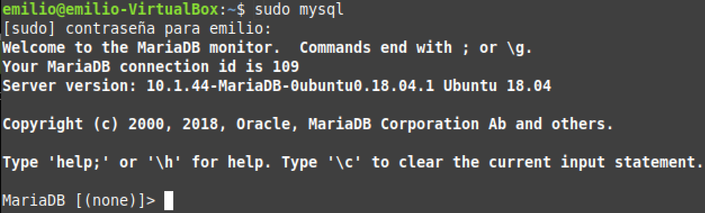
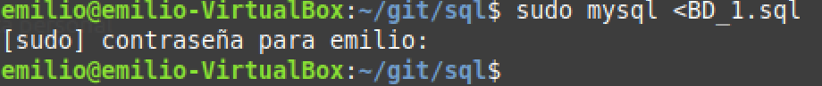

# Crear una Base de datos en consola

Tras instalar MariaDB o MySQL, tenemos dos formas de afrontar esta tarea

### Introducción manual de comandos

Primero tendremos que logearnos como administradores dentro del servidor mediante el comando:

````
sudo mysql
````


Tras esto ya podremos empezar a introducir instrucciones sql para crear nuestra base de datos.

### Uso de Scripts

La otra opción seria tener el código de la base de datos ya preparado en un archivo .sql y ejecutarlo mediante el comando:

````
sudo mysql < direcciondelarchivo/archivo.sql
````



Esto ejecutará automaticamente todas las instrucciones y nos permitira replicar esta base datos entro servidor con facilidad. 
