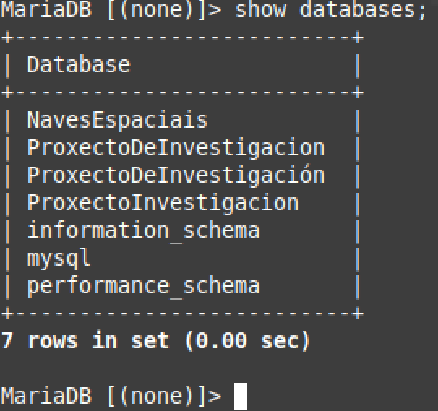

# Inspeccion de la base de datos

Una logeados en el servidor podremos comrpobar las bases de datos existentes usando: 

````sql
show databases;
````

Tambiem podremos ver mas datos sobre ellas usando el comando 
 ````
 USE (nombreBD);
 ````
 y posteriormente la instruccion:
 
 ````
 show tables;
````
Para ver todas las tablas que la forman





para comprobar si la base de tados fue creada

## Codigo base de datos investigación:

https://github.com/emiliofds1/SQL-apuntes/blob/master/BD_1.sql

## Codigo base de datos naves espaciales

https://github.com/emiliofds1/SQL-apuntes/blob/master/BD_2.sql
